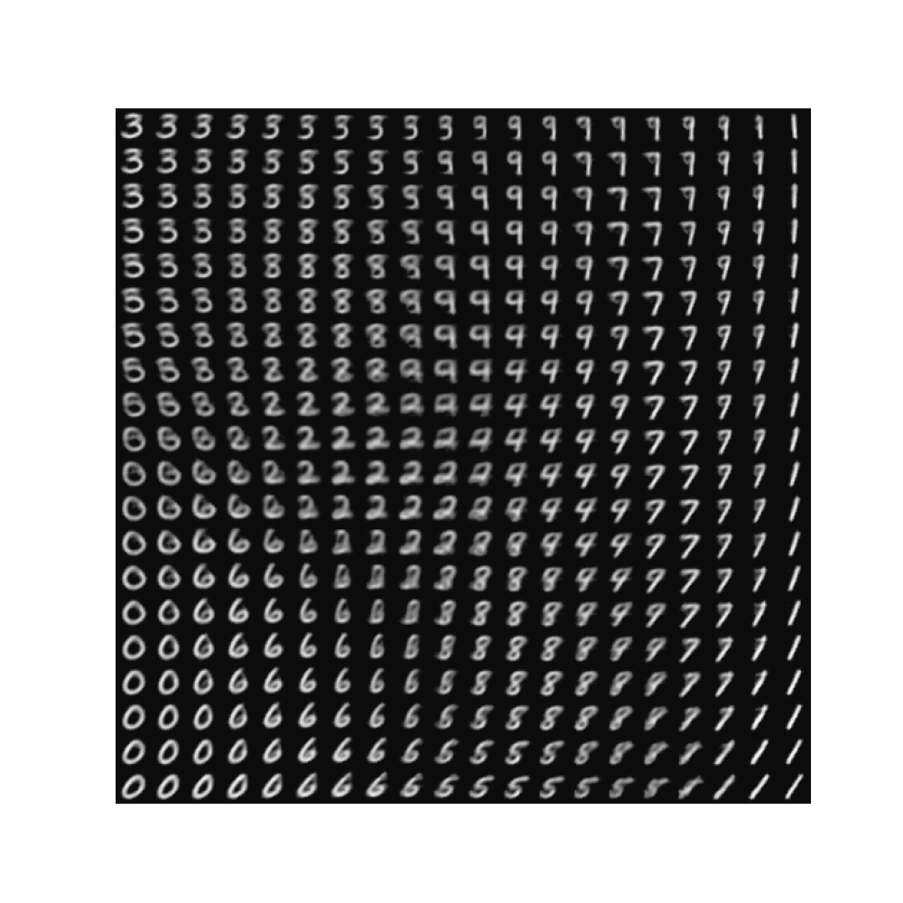
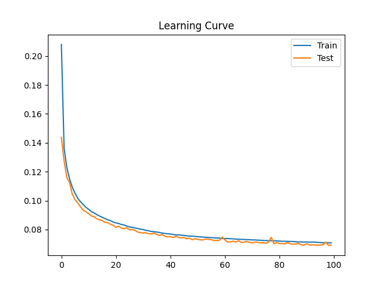
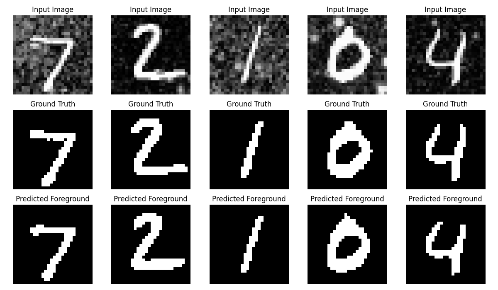

# 利用 CNN (LeNet-5) 进行手写数字识别

## 1. 引言

本项目基于 LeNet-5 架构实现手写数字识别。使用了包含 0 到 9 数字的灰度图像的 MNIST 数据集进行训练和测试。本项目使用了 PyTorch 框架，完成了三个任务：实现原始 LeNet-5 网络、通过减少卷积核数量进行修改、以及增加 dropout 层以提高泛化能力。

## 2. 数据集

本项目使用了 MNIST 数据集，这是手写数字识别的基准数据集。它包含 60,000 张训练图像和 10,000 张测试图像，大小均为 28x28 像素。每张图像代表一个 0 到 9 之间的数字，因此是一个 10 类分类问题。数据集经过预处理，将像素值归一化到 [0, 1] 的范围。

## 3. 网络结构

本项目选择了 LeNet-5 网络，其整体框架包含卷积层、池化层和全连接层的组合结构，用于手写数字的特征提取和分类。具体实现见代码部分。此后进行了多项改进，包括减少卷积核数量和增加 Dropout 层，以探索性能改进的效果。

- **任务 1：原始 LeNet-5 实现**

  使用 PyTorch 实现了原始 LeNet-5 架构。网络使用 Adam 优化器（学习率为 0.001）和交叉熵损失作为目标函数进行训练。训练过程通过绘制损失曲线进行可视化，并在测试损失最低时保存模型参数。

- **任务 2：减少卷积核数量**

  在任务 2 中，修改了原始 LeNet-5 架构，将每个卷积层中的卷积核数量减少了一半。具体来说，第一个卷积层的输出通道从 6 减少到 3，第二个卷积层的输出通道从 16 减少到 8。此修改旨在探索更简单的模型对识别精度的影响。修改后的架构由于模型容量降低，性能略有下降，但计算效率更高。

- **任务 3：增加 Dropout 层**

  在任务 3 中，向修改后的 LeNet 架构中增加了 dropout 层，以缓解过拟合并提高泛化能力。Dropout 分别以 1%、5%、10% 的概率应用于每个池化层和全连接层之后。增加 dropout 层通过在训练过程中随机丢弃单元，有助于防止过拟合，从而提高了验证集的准确率。

## 4. 结论

通过基于 LeNet-5 架构实现手写数字识别实验，可以得出以下结论：LeNet-5 架构在手写数字识别任务中表现出良好的分类精度，能够较好地捕捉手写数字的特征。

  

# 利用 VAE 实现 MNIST 重建

## 1. 引言

本项目实现了变分自编码器（VAE）在 MNIST 数据集上的应用，旨在重建手写数字图像。VAE 是一种生成模型，能够学习输入数据的概率分布并生成相似的数据样本。本项目使用了 PyTorch 框架，使用 MNIST 数据集对 VAE 进行训练和评估。

## 2. 数据集

本项目使用了 MNIST 数据集，包含 60,000 张训练图像和 10,000 张测试图像，大小均为 28x28 像素。每张图像代表一个 0 到 9 之间的数字。数据集经过预处理，将像素值归一化到 [0, 1] 的范围，以便于模型训练。

## 3. 网络结构

VAE 包括编码器和解码器两部分，用于对输入图像进行编码压缩到低维潜在空间，再从潜在空间解码还原出输入图像的结构。具体实现细节见代码部分。

## 4. 损失函数

VAE 的损失函数由两部分组成：

- **重建损失**：使用均方误差（MSE）衡量重建图像与原始输入图像之间的差异。

- **KL 散度损失**：衡量潜在分布与标准正态分布之间的差异，以鼓励潜在空间符合高斯分布。

总损失是重建损失和 KL 散度损失的加权和。

## 5. 结论

VAE 成功地从潜在表示中重建了图像，展示了其学习 MNIST 数字的有意义表示的能力。通过对比原始图像和重建图像，可以观察到 VAE 在学习数据分布方面的有效性。

  

  

# 改进LeNet-5实现手写数字的分割

## 1. 引言

手写数字分割是计算机视觉领域中的经典任务之一，其目的是将手写数字与背景有效地分割开来，为进一步的识别提供精确的输入。本实验基于MNIST数据集，通过对经典的LeNet-5网络进行改进，利用上采样和反卷积技术实现手写数字的前景与背景的分割任务。我们借鉴了全卷积网络（Fully Convolutional Network, FCN）的思想，使得LeNet-5具备像素级别的分割能力，旨在提升手写数字分割任务的表现。

## 2. 数据集

本实验使用的是MNIST手写数字数据集，该数据集包含60,000张训练样本和10,000张测试样本，每张图片大小为28x28像素，包含0-9的手写数字。
为了对手写数字进行分割，本实验对MNIST数据进行了数据增强，具体步骤如下：
1.	将手写数字图像转换为灰度值，并通过设定阈值将手写数字提取为前景。
2.	利用网络获取的背景图像，随机切取28x28像素大小的patch作为背景图。
3.	将前景手写数字和随机的背景patch进行拼接，生成合成的图像，形成新的训练数据，同时生成对应的分割标签（Ground Truth），用于指导网络学习。

## 3. 网络结构

本实验基于LeNet-5结构进行改进，使其能够进行像素级别的分割任务。改进后的网络结构如下：
-	卷积层1（Conv1）：输入通道为1，输出通道为6，卷积核大小为5x5，使用ReLU激活函数。
-	池化层1（Pool1）：最大池化操作，窗口大小为2x2。
-	卷积层2（Conv2）：输入通道为6，输出通道为16，卷积核大小为5x5，使用ReLU激活函数。
-	池化层2（Pool2）：最大池化操作，窗口大小为2x2。
-	反卷积层1（Deconv1）：输入通道为16，输出通道为6，卷积核大小为5x5，使用ReLU激活函数。
-	上采样层1（Up1）：将特征图进行2倍的上采样，使用双线性插值。
-	反卷积层2（Deconv2）：输入通道为6，输出通道为1，卷积核大小为5x5，使用ReLU激活函数。
-	上采样层2（Up2）：将特征图上采样到28x28大小。
最终输出经过Sigmoid激活函数，将每个像素的值映射到0-1之间，用于表示该像素属于前景（手写数字）或背景的概率。

## 4. 实验结果

实验在改进后的LeNet-5网络上进行了训练和测试，损失函数采用二元交叉熵损失函数（Binary Cross-Entropy Loss），优化器使用Adam优化器。实验结果如下：
- **训练曲线**：在训练过程中，记录了训练损失和测试损失的变化，结果显示随着训练轮次的增加，损失逐渐降低，表明网络在逐渐收敛。

  

-	**测试损失**：最终的测试损失为0.0691，表明改进后的网络在手写数字分割任务上取得了较好的性能。
-	**分割效果可视化**：为了验证模型的分割效果，我们对测试集中的样本进行了可视化，包括原始输入图像、分割的Ground Truth，以及网络预测的分割结果。从结果中可以看到，模型能够较好地分割出手写数字的前景部分，与Ground Truth基本吻合。

  

## 5. 结论
本实验基于LeNet-5改进了其结构，使其具备像素级别的分割能力，应用于MNIST手写数字的前景背景分割任务。实验结果表明，通过使用反卷积和上采样技术，改进后的LeNet-5能够有效地分割手写数字的前景与背景，且在测试集上的表现良好，证明了其在分割任务中的有效性。这一改进网络可以为进一步的手写数字识别提供更加精确的输入，为其他类似的视觉任务提供借鉴。
